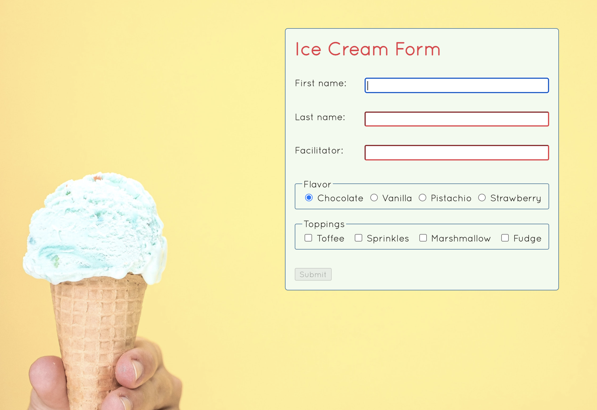

# Ice Cream Form

*This project was a solo assignment for BU MET CS601 and copying any portion of it is a violation of Boston University's Academic Conduct Code.*

## Technologies
* HTML
* CSS
* JavaScript
* Regular Expressions

## Summary
This project focuses on pretty front-end design and JavaScript event listeners. There are two kinds of form validation: the submit button is only enabled if all fields are completed, and once the form is submitted the data is verified and an error is displayed if the facilitator name is not one of the four pre-selected options or the first/last name are not properly formed.